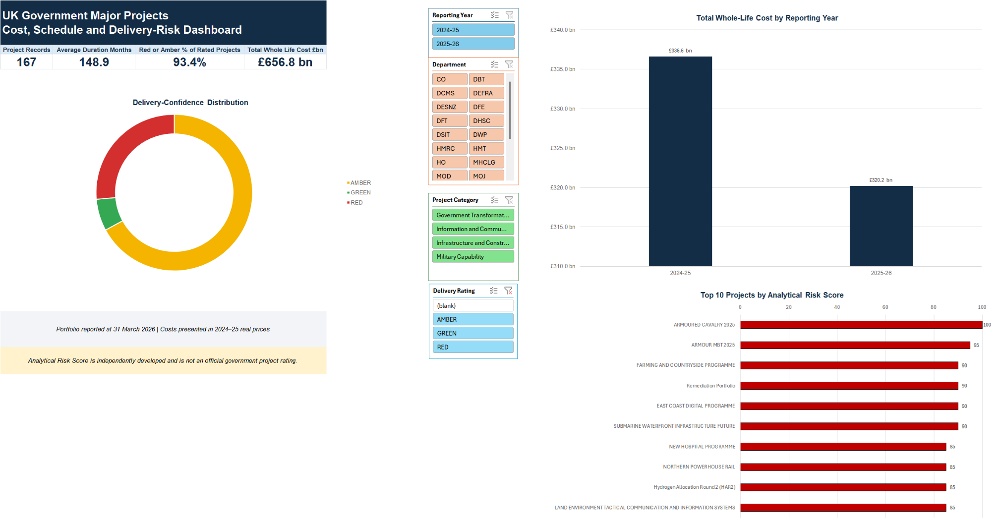
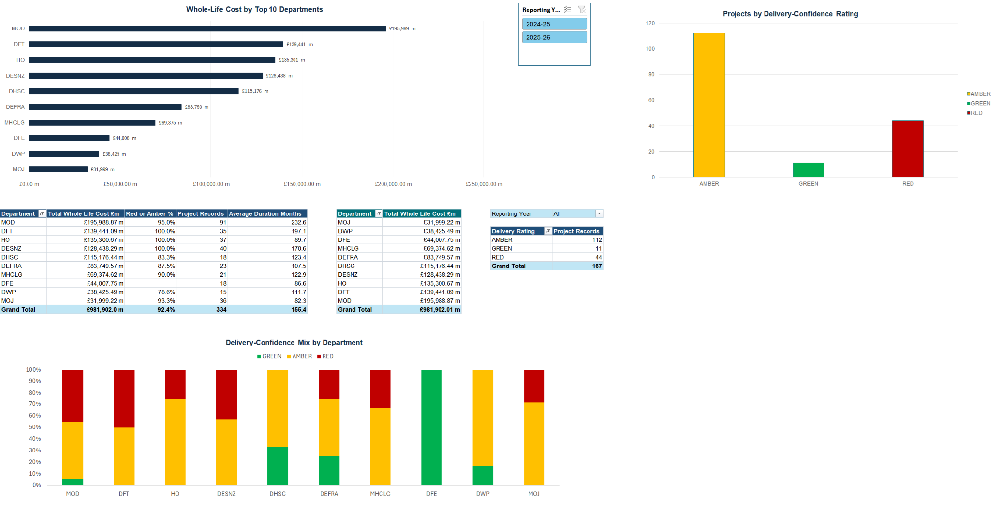
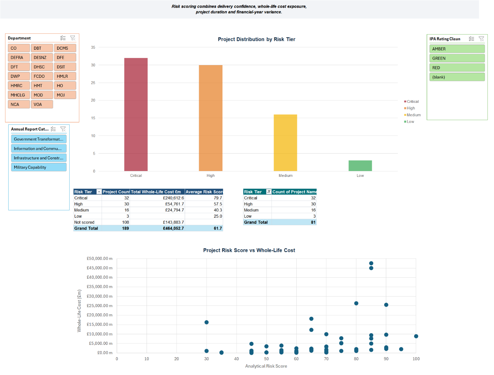
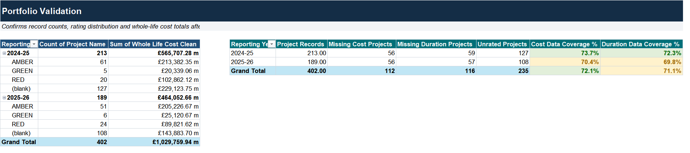

# UK Government Major Projects Risk Dashboard

An Excel portfolio analytics project examining UK Government Major Projects across the **2024-25 and 2025-26** reporting periods. The workbook combines annual NISTA Major Projects data through Power Query, models the portfolio with Power Pivot, and presents cost, schedule, delivery-confidence and custom analytical-risk views through PivotTables, PivotCharts and slicers.

## Project objective

The project is designed to answer four practical questions:

1. How large is the government major-project portfolio by department and reporting year?
2. Which projects and departments carry the greatest cost, duration and delivery-confidence exposure?
3. How does the rating mix change between reporting periods?
4. Can a transparent analytical score help prioritise projects for further investigation without pretending to replace official assurance ratings?

## Data and refresh model

The workbook uses the **NISTA Major Projects Annual Report dataset** for 2024-25 and 2025-26. The source grain is one row per project per reporting period, with whole-life cost presented in **2024-25 real prices (£m)**.

Power Query connections in the workbook include:

- `stg_GMPP_2024_25`
- `stg_GMPP_2025_26`
- `fact_GMPP_AllYears`
- `risk_ProjectRegister`
- `dim_Department`
- `dim_ReportingYear`

The portfolio copy is cached so reviewers can inspect the workbook without the source CSV folder. A full refresh requires the annual source files in the established local folder structure.

## Analytical risk framework

The workbook applies a custom **100-point analytical risk score**. It is explicitly not an official NISTA, IPA or departmental rating.

| Component | Scoring approach | Maximum points |
|---|---|---:|
| Delivery confidence | Green 5, Amber 25, Red 40 | 40 |
| Whole-life cost exposure | Under £100m to £5bn+ bands | 25 |
| Duration exposure | Under 3 years to 10+ years | 20 |
| Financial-year variance | 0% or lower to 20%+ | 15 |
| **Maximum** |  | **100** |

Risk tiers are: **Critical 70-100, High 50-69, Medium 30-49, Low below 30**. Projects without a usable IPA rating are marked **Not scored**.

## Cached findings

The data-quality page reports:

| Reporting year | Project records | Whole-life cost | Missing cost | Missing duration | Unrated |
|---|---:|---:|---:|---:|---:|
| 2024-25 | 213 | £565.71bn | 56 | 59 | 127 |
| 2025-26 | 189 | £464.05bn | 56 | 57 | 108 |

For the cached 2025-26 risk summary, **81 projects receive a score**: 32 Critical, 30 High, 16 Medium and 3 Low. A further 108 projects are not scored because a usable delivery-confidence rating is unavailable. Critical-tier projects represent approximately **£240.61bn** of whole-life cost in the cached view.

The department summary also shows that the largest cost concentrations are not necessarily the same thing as poor project management: the methodology treats cost and duration as **exposure and complexity**, not evidence of failure.

## Workbook structure

| Worksheet | Role |
|---|---|
| `README` | Start here, refresh instructions and workbook overview |
| `Executive Dashboard` | Portfolio KPIs, rating mix and year comparison |
| `Departmental Analysis` | Department cost, duration and rating comparison |
| `Project Risk Register` | Sortable project-level analytical risk register |
| `Risk Summary` | Risk-tier distribution and cost exposure |
| `Data Quality` | Record-count, missing-data and coverage checks |
| `Methodology` | Cleaning rules, scoring rules and limitations |
| `Pivot Support` | Supporting PivotTables/formulas for dashboard visuals |

The raw annual CSVs are intentionally not copied into separate worksheets. Power Query handles the source/staging layer, while the portfolio workbook exposes the transformed project register and cached analytical outputs.

## Dashboard walkthrough

### Departmental analysis

### Risk summary

### Data-quality controls

## Auditability

The workbook includes a dedicated methodology sheet, a dedicated data-quality page, a refresh checklist, a project-level risk register and an explicit disclaimer around the custom score. Original text fields are retained where source data contains exemptions, planning-stage notes or ranges; cleaned numeric/date fields are used separately for analysis.

See [Formula, Query & Model Guide](docs/FORMULA_GUIDE.md), [Workbook Architecture](docs/WORKBOOK_ARCHITECTURE.md) and [Data Sources](docs/DATA_SOURCES.md).

## Files

### Interactive dashboard

The source-backed Streamlit dashboard is in `dashboard/`. Run `pip install -r requirements.txt` and then `streamlit run dashboard/app.py`. For Streamlit Community Cloud, set `dashboard/app.py` as the entry point. The checked-in `dashboard/data/projects.csv` is derived from the two annual NISTA workbooks; it needs no local Excel connection to render. To rebuild that snapshot from the original files, run `python dashboard/prepare_data.py GMPP_2024_25.xlsx GMPP_2025_26.xlsx`.

Figures use full-width rows for long department and project labels, with consistent value placement and an explicit distinction between published delivery ratings and the independent analytical risk score. The dashboard includes reporting-year, department, and category filters, a project register, and data-quality checks.

- [`workbook/UK_GMPP_Risk_Dashboard_Portfolio.xlsx`](workbook/UK_GMPP_Risk_Dashboard_Portfolio.xlsx) - cached portfolio workbook
- [`docs/UK_GMPP_Project_Summary.pdf`](docs/UK_GMPP_Project_Summary.pdf) - 3-page project summary
- [`docs/FORMULA_GUIDE.md`](docs/FORMULA_GUIDE.md) - Power Query, Data Model, scoring and worksheet logic
- [`docs/WORKBOOK_ARCHITECTURE.md`](docs/WORKBOOK_ARCHITECTURE.md) - model and worksheet map
- [`docs/DATA_SOURCES.md`](docs/DATA_SOURCES.md) - source and refresh notes

## Limitations

- The analytical risk score is independently developed and is not an official government assessment.
- High cost and long duration indicate exposure, not necessarily poor delivery.
- Financial-year variance is not the same as whole-life cost overrun.
- Projects without a usable delivery-confidence rating are not assigned a total analytical score.
- Missing dates reduce the number of projects available for duration analysis.
- Year-to-year movement can reflect projects entering or leaving the portfolio as well as changes to continuing projects.

**Tools demonstrated:** Excel 365, Power Query, Power Pivot, DAX, PivotTables, PivotCharts, slicers, conditional formatting and data-quality controls.
